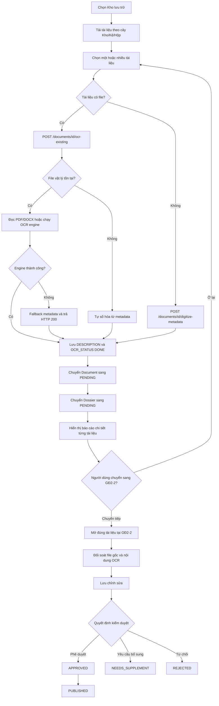

# Workflow OCR hàng loạt và Kiểm tra/Phê duyệt

## 1. Phạm vi

Tài liệu này mô tả luồng nghiệp vụ liên thông trong dự án **IDP.DMS**:

- **GĐ2-6 / GĐ2-19:** Chọn Kho, đính kèm tệp và bóc tách OCR hàng loạt.
- **GĐ2-2:** Kiểm tra, hiệu chỉnh, yêu cầu bổ sung, từ chối, phê duyệt và xuất bản.
- **Oracle Database:** Lưu trạng thái, nội dung OCR, phiên bản tài liệu và lịch sử workflow.

## 2. Sơ đồ tổng thể



## 3. Workflow chi tiết tại GĐ2-6 / GĐ2-19

### Bước 1: Chọn Kho lưu trữ

1. Người dùng chọn Kho từ dropdown **Chọn Kho lưu trữ**.
2. Frontend xóa ngay danh sách cũ, checkbox, tiến trình và kết quả batch.
3. Frontend gọi:

```http
GET /api/dms/gd2/documents/search?storageId={storageId}&page=1&pageSize=500
```

4. Backend truy vấn tài liệu thuộc đúng Kho và toàn bộ Kệ/Hộp con bằng cây phân cấp Oracle.
5. Frontend kiểm tra lại `dossier.storageId` để loại bỏ dữ liệu không thuộc cây Kho đang chọn.
6. Response của lần chọn Kho cũ sẽ bị bỏ qua nếu trả về trễ.

### Bước 2: Chọn tài liệu

Người dùng có thể:

- Chọn từng tài liệu.
- Chọn tất cả tài liệu trong Kho.
- Bóc tách nhanh một tài liệu.
- Đính kèm một hoặc nhiều file cho các tài liệu đang chọn.

Thanh trạng thái hiển thị:

```text
Đã chọn: X / Tổng số: Y tài liệu trong kho [Tên Kho]
```

### Bước 3: Đính kèm tệp hàng loạt

Nút thao tác:

```text
📁 Đính kèm tệp cho các tài liệu đang chọn
```

Quy tắc:

- Chọn **một file**: file được áp dụng chung cho toàn bộ tài liệu đang thiếu file.
- Chọn **nhiều file**: file được ghép theo thứ tự các tài liệu đang chọn.
- Backend kiểm tra định dạng và dung lượng theo hạn mức đơn vị.
- Định dạng hỗ trợ: PDF, DOCX, TIFF, PNG, JPG/JPEG.

API upload:

```http
POST /api/dms/documents/{documentId}/upload
Content-Type: multipart/form-data
```

### Bước 4: Bóc tách OCR

Nút thao tác:

```text
⚡ Bóc tách OCR các tài liệu đã chọn
```

Frontend lặp tuần tự qua danh sách tài liệu đã chọn để một lỗi không làm dừng toàn bộ batch.

#### Trường hợp tài liệu có file

Frontend gọi:

```http
POST /api/dms/documents/{documentId}/ocr-existing?engine={engine}&unitCode=DEFAULT
```

Backend xử lý:

1. Kiểm tra bản ghi tài liệu trong Oracle.
2. Kiểm tra file vật lý trong thư mục `uploads/`.
3. Nếu file tồn tại, đọc hoặc OCR nội dung.
4. Nếu file không tồn tại, tự sinh nội dung số hóa từ metadata.
5. Cập nhật `OCR_STATUS = DONE` và lưu nội dung vào `DESCRIPTION`.
6. Trả HTTP 200.

#### Trường hợp tài liệu chưa có file

Frontend gọi:

```http
POST /api/dms/documents/{documentId}/digitize-metadata?unitCode=DEFAULT
```

Nội dung mặc định:

```text
[Đã số hóa tự động] Văn bản: [Tên tài liệu] (Mã: [Mã tài liệu]) - Ngày tạo: dd/MM/yyyy HH:mm
```

Tài liệu vẫn được cập nhật `OCR_STATUS = DONE` và tiếp tục batch.

## 4. Smart OCR Engine Fallback

### Thứ tự fallback

```text
Gemini Vision AI
    ↓
VietOCR
    ↓
EasyOCR
    ↓
Tesseract
    ↓
Số hóa metadata
```

### Xử lý theo định dạng

| Định dạng | Cách xử lý ưu tiên |
|---|---|
| PDF có text layer | Đọc trực tiếp bằng PdfPig |
| DOCX | Đọc trực tiếp nội dung OpenXML |
| PNG/JPG/JPEG | Engine OCR được chọn và chuỗi fallback |
| TIFF | VietOCR/EasyOCR/Tesseract |
| Không có file hoặc mất file vật lý | Số hóa metadata |

### Trường hợp Gemini chưa có API key

Hệ thống không ném lỗi làm dừng batch. OcrService tự chuyển sang chuỗi engine cục bộ:

```text
VietOCR → EasyOCR → Tesseract
```

### Fallback cuối tại frontend

Nếu API OCR vẫn trả lỗi 404/500 ngoài dự kiến, frontend cập nhật trực tiếp metadata:

```json
{
  "ocrStatus": "DONE",
  "description": "Đã số hóa: [Tên tài liệu]"
}
```

Sau đó workflow vẫn tiếp tục chuyển tài liệu sang `PENDING`.

## 5. Chuyển trạng thái sau OCR

Khi một tài liệu có `OCR_STATUS = DONE`, frontend gọi workflow transition:

```http
POST /api/dms/gd2/workflow/transition
Content-Type: application/json
```

Payload tài liệu:

```json
{
  "entityType": "DOCUMENT",
  "entityId": 123,
  "action": "SUBMIT",
  "actor": "current-user",
  "unitCode": "DEFAULT",
  "comment": "Tự động gửi kiểm tra sau khi OCR hoàn tất",
  "recipient": "LANH_DAO_DON_VI"
}
```

Payload hồ sơ sử dụng `entityType = "DOSSIER"` và ID hồ sơ tương ứng.

Kết quả:

```text
Document: DRAFT / ERROR / NEEDS_SUPPLEMENT / REJECTED → PENDING
Dossier:  DRAFT / NEEDS_SUPPLEMENT / REJECTED → PENDING
```

## 6. Báo cáo kết quả Batch OCR

Sau khi batch kết thúc, giao diện hiển thị kết quả riêng từng tài liệu.

Ví dụ:

```text
Quyết định 01: Thành công (Đã OCR bằng PdfPig)
Hợp đồng 02: Thành công (Đã OCR bằng EasyOCR — engine fallback)
Công văn 03: Thành công (Tự động số hóa metadata do chưa có tệp đính kèm)
Bản vẽ 04: Thành công (Frontend fallback số hóa metadata do API OCR lỗi)
```

Nếu hồ sơ chưa chuyển được trạng thái, kết quả tài liệu có thêm cảnh báo nhưng batch vẫn tiếp tục.

## 7. Chuyển tiếp sang GĐ2-2

Sau khi có ít nhất một tài liệu thành công, hệ thống hiển thị:

```text
🚀 Chuyển sang Bước Kiểm tra & Phê duyệt (GĐ2-2)
```

Handoff context gồm:

```json
{
  "focusDocumentId": 123,
  "documentIds": [123, 124],
  "dossierIds": [10],
  "storageId": 1,
  "createdAt": "2026-08-17T10:00:00.000Z"
}
```

GĐ2-2 sử dụng `focusDocumentId` để tự mở đúng tài liệu vừa OCR.

## 8. Workflow kiểm tra và phê duyệt tại GĐ2-2

### Giao diện đối soát

#### Cột trái

- Danh sách tài liệu chờ duyệt.
- File PDF hoặc ảnh gốc.
- Zoom in, zoom out và xoay trang.

#### Cột phải

- Số hiệu.
- Ngày ban hành.
- Trích yếu.
- Toàn văn OCR.
- Ý kiến xử lý.
- Lịch sử workflow.

### Lưu chỉnh sửa

API:

```http
PUT /api/dms/gd2/documents/{documentId}/review-content
```

Kết quả:

- Cập nhật `DMS_DOCUMENTS.DESCRIPTION`.
- Tạo snapshot trong `DMS_DOCUMENT_VERSIONS`.
- Ghi sự kiện `EDIT_OCR` trong `DMS_WORKFLOW_EVENTS`.

### Phê duyệt

```text
PENDING → APPROVED → PUBLISHED
```

Hệ thống gọi hai transition liên tiếp:

1. `APPROVE`.
2. `PUBLISH`.

### Yêu cầu bổ sung

Người duyệt bắt buộc nhập lý do.

```text
PENDING → NEEDS_SUPPLEMENT
```

Ví dụ:

```text
Ảnh bị mờ trang 2, cần quét lại.
```

### Từ chối

Người duyệt bắt buộc nhập lý do.

```text
PENDING → REJECTED
```

Tài liệu không bị xóa khỏi Oracle.

## 9. Đồng bộ Oracle Database

| Bảng | Dữ liệu được cập nhật |
|---|---|
| `DMS_STORAGE_LOCATIONS` | Cây Kho/Kệ/Hộp |
| `DMS_DOSSIERS` | Kho chứa hồ sơ và trạng thái workflow |
| `DMS_DOCUMENTS` | File, `OCR_STATUS`, `STATUS`, `DESCRIPTION` |
| `DMS_DOCUMENT_VERSIONS` | Snapshot trước mỗi chỉnh sửa hoặc transition |
| `DMS_WORKFLOW_EVENTS` | Lịch sử gửi duyệt, chỉnh sửa, bổ sung, từ chối, phê duyệt, xuất bản |
| `DMS_NOTIFICATIONS` | Thông báo cho người/nhóm tiếp nhận |

## 10. Ma trận trạng thái

| Trạng thái | Ý nghĩa | Hành động tiếp theo |
|---|---|---|
| `DRAFT` | Tài liệu nháp | OCR và gửi duyệt |
| `PROCESSING` | Đang OCR | Chờ kết quả |
| `DONE` | OCR hoàn tất | Chuyển `PENDING` |
| `ERROR` | OCR từng lỗi | Chạy lại hoặc fallback metadata |
| `PENDING` | Chờ kiểm tra | Phê duyệt, bổ sung hoặc từ chối |
| `NEEDS_SUPPLEMENT` | Cần bổ sung/quét lại | Bổ sung rồi gửi lại |
| `REJECTED` | Không hợp lệ | Sửa hoặc gửi lại nếu được phép |
| `APPROVED` | Đã phê duyệt | Xuất bản |
| `PUBLISHED` | Đã xuất bản | Tra cứu và khai thác |

## 11. API chính

| API | Phương thức | Mục đích |
|---|---|---|
| `/api/dms/gd2/documents/search` | GET | Lấy tài liệu theo cây Kho |
| `/api/dms/documents/{id}/upload` | POST | Upload file và OCR |
| `/api/dms/documents/{id}/ocr-existing` | POST | OCR file đã lưu hoặc fallback metadata |
| `/api/dms/documents/{id}/digitize-metadata` | POST | Số hóa tài liệu không có file |
| `/api/dms/gd2/workflow/transition` | POST | Chuyển trạng thái workflow |
| `/api/dms/gd2/documents/{id}/review-content` | PUT | Lưu nội dung OCR đã hiệu chỉnh |
| `/api/dms/documents/{id}/file` | GET | Xem file gốc |

## 12. Lưu ý vận hành

- Khởi động lại Backend API sau khi triển khai code mới.
- Cấu hình `Gemini:ApiKey` nếu muốn sử dụng Gemini Vision AI.
- Nếu không có Gemini API key, hệ thống vẫn hoạt động bằng engine cục bộ.
- Kiểm tra Python, VietOCR, EasyOCR và Tesseract nếu cần OCR ảnh thực tế.
- PDF số có text layer không cần gọi AI hoặc Python.
- Không xóa trực tiếp tài liệu khi từ chối; sử dụng trạng thái `REJECTED` để bảo toàn lịch sử.
- Mọi tài liệu/hồ sơ mới phải được gán đúng `storageId` của Kho đang thao tác.

